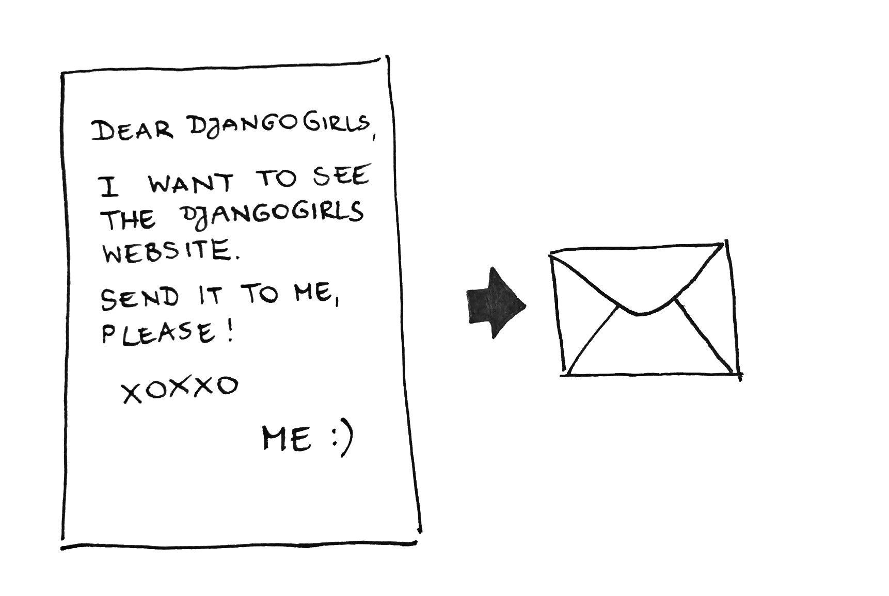

# I. Terms: Editor, Virtual machine - Are those edible?

Let’s start with some terminology to make sure we’re on the same page.
Do you know what those are: notepad / word, virtual machine / container. Discuss it with your team to share knowledge, check it on the internet (ask Uncle Google) or ask your mentor.

1. Editors
 Create a notepad file and save it as .py file (can’t do it with word)
 Code is just a simple text saved in a file with specific extension. Extension is the ending of the name of the file. File extensions are not required - we can easily save files without any extension. The usage of the extension is to tell the file system with which program to associate the file. Nothing more.

 The text files often end with '.txt' but when writing code in python we should end our files with '.py'. When creating html documents, our files will end with '.html'.
 Word documents are not text files. The Word files contain special characters for styling and formatting the text. You can try opening word document with notepad to see yourself.

2. Virtual machine / container
 It's remote computer somewhere in the network

##Codeanywhere

Codeanywhere is a web tool that allows you to reach a remote computer on the internet (virtual machine), where you have a handy editor and shell prepared for your needs.

  Usually when you write code you need to install many other tools to help you build your program. Imagine that you want to make a birthday cake to surprise your room mate. But you can not make it at home cause … first - she’ll see you, and second - you do not have all the ingredients or the oven is broken. What you do?

  You go to your Mum’s kitchen where you have all you need for a birthday cake (and even more) - you have oven, you have flour, sugar, milk, a mixer - everything! And you just start cooking!


  It’s the same with the codeanywhere - you get the right environment (yes, that’s what it’s actually called) on a remote computer (kitchen) and you can use the oven and mixer (the shell and the editor) to prepare the cake (your project).


  So, what are you doing next is… You’re going to use one of those web sites on the Internet (codeanywhere) that gives you the kitchen to create your project there. In order to use it you’ll first create an account. It’s easy and quick - don’t worry. Just follow the steps.


  1) Open your browser and then open this URL: https://codeanywhere.com/

  2) Click on SING UP

  3) Fill in your email and type a password, choose “I’m not a robot” and click on the “Register” button


  

  

  Great! You now have an account. Now open the editor.


  4) Create a project - choose a name and select Django (Ubuntu). You can type django in the search field to help you find this type of project. Once you’re ready, click the “CREATE” button

  

  5) Be patient and wait till the container is ready (your kitchen is being prepared along with providing the basic ingredient for your cake).

  

  6) One useful keyboard shortcut
  One thing that is useful not only here in codeanywhere: When you want to copy something, instead of “right click with the mouse -> Copy” you can press Ctrl and C keys at the same time. Pasting works the same way - just press Ctrl and P together. Try it!

  

  You can close that message box.


  7) Congrats! You have a Django project! The project contains several folders with code in them and it’s the base (the minimum but enough code) that is needed for the project to run.


### What we learned so far:

  * We learned what virtual machine, shell and editor are.
  * We learned that there are sites in Internet, that allow you to reach a remote machine with editor and shell and to create a project on it. This allows you to work on a project without having to install things on your machine.
  * Ctrl + C = Copy
  * Ctrl + V = Paste


# II. How Internet works


Imagine that when you type https://djangogirls.org in your browser and hit Enter, you send a letter that says: "Dear Django Girls, I want to see the djangogirls.org website. Send it to me, please!"

  

Your letter than travels along the Internet until it gets to one computer (called server) where the djangogirls site lives.

  


The server receives your message, takes a sheet of paper, writes the response down and send this page back to you so you can see it on your computer. Yes, it is as simple as that. You send messages and you expect some response. Of course, instead of paper and pen you use bytes of data, but the idea is the same!
So, basically, when you have a website, you need to have a server (machine) where it lives. When the server receives an incoming request (in a letter), it sends back your website (in another letter).


##How Internet looks?
Well... it looks like this:

  


Looks like a mess, right? In fact it is a network of connected machines (the above-mentioned servers). Hundreds of thousands of machines! Many, many kilometers of cables around the world!

  


It is fascinating, isn't it? But obviously, it is not possible to have a wire between every machine connected to the Internet. So, to reach a machine (for example, the one where https://djangogirls.org is saved) we need to pass a request through many, many different machines.

In other words: When you send it, your letter goes to the post office closest to you. Then it goes to another that is a bit nearer to your addressee, then to another, and another until it is delivered at its destination - the server.

It looks like this:


  


#III. What happens on the server

  

The server is the place where the site lives. But what does that mean?
Well.. The site is actually a project, and the project is a bunch of files (Remember we have created our project already - we have our bunch of files on a remote server. Let’s call this project Django)

So, Django has 3 main parts (files): A list of functions, functions that take the message and return answers, and templates, used to write the response letter down.

  

### urls.py

When a request comes to the web server, it’s passed to Django. Django’s the one who will take the requested url and check who’s taking care for it (which function is responsible). In order to do that, Django has a list of all provided urls  - this list is called urls.py.

Example: The djangogirls site has many different pages and each one has its own url. So the djangogirls project keeps those urls in a list (urls.py). Each row of the list contains one url and a function that is responsible for this url. The function is called view. Something like that:

https://djangogirls.org/  (home page)       - home_view
https://djangogirls.org/events/  (events page)       - events_view
https://djangogirls.org/newsletter/  (newsletter page)     - newsletter_view
https://djangogirls.org/organize/ (organize page)      - organize_view


So when you ask the server to send you the home page, it asks the urls.py file and finds out that someone called “home_view” should take care of the request.


Imagine your letter reached the final post office (the server). The mail carrier reads the address on the letter and checks in her list of addresses, where she sees the name Mr. Home. He’s the one who will take the message.


### views.py
The views.py file is actually the file with all the functions.
Once that letter (request) is received to its function, the function reads it and provides what’s requested. Requests made to the server may not be only “Give me that page”. They can also be… “Save my data” or “Show me my profile”, "Please change the description of my job". In this case the django view (the function) should first check who you are, whether you’re allowed to get what you asked for. The view can prepare some information or save it into a database…
Let’s keep it simple for now and see what happens when the home page is requested for example.

The “home_view” has received the letter saying “Please, give me the home page”. So it takes the template and sends it back as an answer.

### template
Imagine the home_page template as a sheet of paper where the home page is painted. It can be a white page, saying “Hello” or a colorful page with photos, links, etc.

Depending on the projects and frameworks those 3 main parts might be named differently. But the logic behind is similar for all. So.. let’s give it a try!

# IV. Make your first page

Let’s say we would like to create a home page for our site. (or whatever page you would like)

What do we do?

Well… You already know the answer - we need to provide the 3 base components:

* Url  (something like http://mysitel.com/home/)
* View (someone to be responsible for this url - to answer and provide html template )
* Template


1. Every django project has a urls.py file created by default when the project is created. Go find the urls.py file in the tree (the one in the left column). Open it.

  


 You do not have to understand what exactly those lines mean. The important thing is that this file contains a list of paths. The server uses this list to check who’s responsible for the requested path. Pay attention to this row for example:
  url(r'^admin/', admin.site.urls),
 This row says that when you ask the server about  http://mysitel.com/admin/  the server should give this request to something called “admin.site.urls” and it will handle it.


 Let’s put one more item in the server’s list.
 We want to tell our server: “Hey, server, when someone asks about http://mysitel.com/home/” you can give it to my view (let’s call it “home_view”).


 Copy the following lines and replace the whole content of the urls.py file with the following lines:


    from django.conf.urls import url
    from django.contrib import admin
    from .views import home_view

     urlpatterns = [
         url(r'^admin/', admin.site.urls),
         url(r'^home/', home_view),
     ]

  

 Do you notice what changed?


2. Create file named views.py.

  

  

 Since we told our server that home url will be handled by something called home_view, it’s time to create that view.

 Copy those lines to your views.py file and take a few seconds to explore it.


    from django.shortcuts import render

    def home_view(request):
        return render(request, 'home.html')

 Those few lines mean “I’m home_view and I expect someone to give me a request. When they give me a request, I’ll give them a template” - called home.html

3. Well let’s now create this template. First create folder named templates.

  

 Add a file named home.html to that folder (you already know how ;) )

 Copy the following lines into the template file.
 
```
    <!DOCTYPE html>
    <html>
    <body>
    <h1>Hello!</h1>
    <p>Welcome to my awesome page!!</p>
    </body>
    </html>
```

 

4. One last detail: Every project has its secrets and there are many files and folders that we don’t need to understand. Don’t think about them right now. As in the real world… we don’t always do things we understand entirely. And that’s totally fine.


 Do you know how the car actually works? Do you know how the engine of your car works? - No, of course. But you still drive it, right?
 Well… Unfortunately from time to time you need to put some gas in the tank - no need to know where it goes after that and how it’s used.


 For our project we’ll need to do something similar. Do not think about why … Just follow the instructions:

 Find the settings.py file and find the line that says…. TEMPLATES = …
 And few lines below you’ll see another line:
  'DIRS': [],

 Replace this line with the following:
 
```
'DIRS': [os.path.join(os.path.dirname(os.path.abspath(__file__)), "templates")],
```

  


**Do not be afraid to do things you don’t understand!**


Great, and now…. The sweetest part!

**Run! Finally!**

  

Pay attention to the url from your first page.
It’s the url where you will see your site in a while, so copy it.

  


Copy that url and paste it to your browser. Do not forget “ :8000” behind. Hit Enter and… enjoy :)


  


Last challenge: Change the page so that is says “Hi, I just made my first web page! Yuppie!”

#V. Enjoy

Choose your path further - depending on your mood or interests, choose some of the following activities and ask your coach to help:


* Make it look better (HTML & CSS)
* Pass context to your template
* Try some python
* Shell - try navigating to your project's folder and run the server manually
* Create app (run the server using manage.py instead of the “RUN” button)
* What is a Database (or where my data is saved).
* Create a model / see it in the admin.
* Here's a list of topics you can choose from: https://github.com/GirlsWhoCodeInBulgaria/Resources/tree/master/stage_unknown

You can find some additional help and instructions for some of the suggested activities. Ask your coach for assistance.

Python
-

You can try https://repl.it/languages/python3

Shell
-

Open a shell - it’s fun! And makes you look like a hacker ;) (you know.. Black screen full of rows...)

You can create files, stop processes and control your computer through the terminal/cmd.
You can open a command prompt in Windows by pressing Win + R and typing "cmd". In Linux you can open terminal by pressing Ctr + Alt + T.

A while ago people didn't have this colorful graphic interfaces that we have now. They could interact with the computer only through the command prompt by typing different commands.
Interacting with the console is easy. We type text based commands and see the text result of the command right away.
We can start/stop programs directly from the console. We have access to the whole file system - we can move, delete, rename files and folders. We can have more than one console at a time - each doing different things.

Here are some commands you can try:


Linux | Windows |
----- | ------- | ------
ls    |  dir    | lists the files and folders in the directory(folder)
cd    |  cd     | change the current (working) directory
pwd   |  echo %cd%  | prints the current (working) directory - like path/three in explorer
example:
* ` cd ..`
* `cd django`
* `cd .`


Try them yourself. See what happens. Explore. Try opening a file from the command prompt. Try typing "explorer ." in Windows. What happens?

## Materials:

You are aeger to learn more? You're at the right plpace. Here's a list of suggested materials:


Django:

https://tutorial.djangogirls.org/en/
https://docs.djangoproject.com/en/1.10/intro/tutorial01/


Python:

https://www.pythonanywhere.com/try-ipython/ - online python interpreter
https://www.codeschool.com/courses/try-python


HTML & CSS:

https://www.khanacademy.org/computing/computer-programming/html-css
https://www.codecademy.com/en/tracks/web


Tasks to try if you are out of ideas:

https://github.com/HackBulgaria/Programming101/blob/master/week0/simple_problems.md
https://github.com/HackBulgaria/Programming101/blob/master/week0/simple_problems2.md
https://github.com/HackBulgaria/Programming101/blob/master/week0/simple_problems3.md
